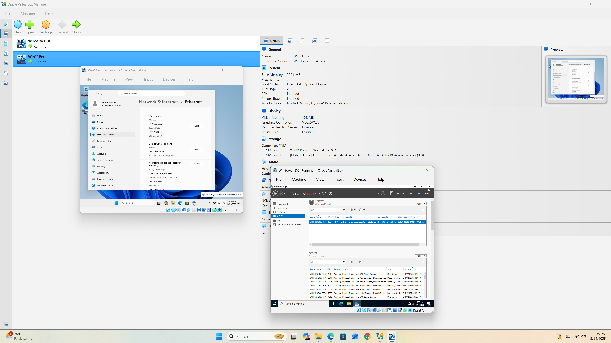
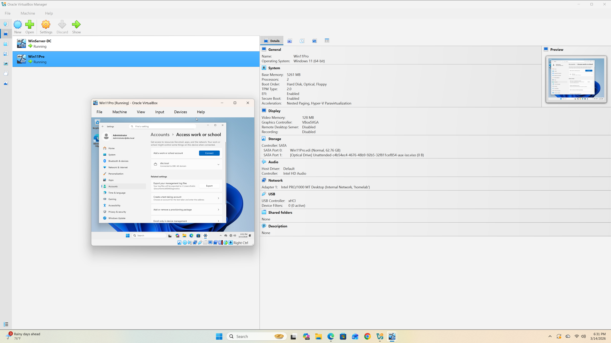
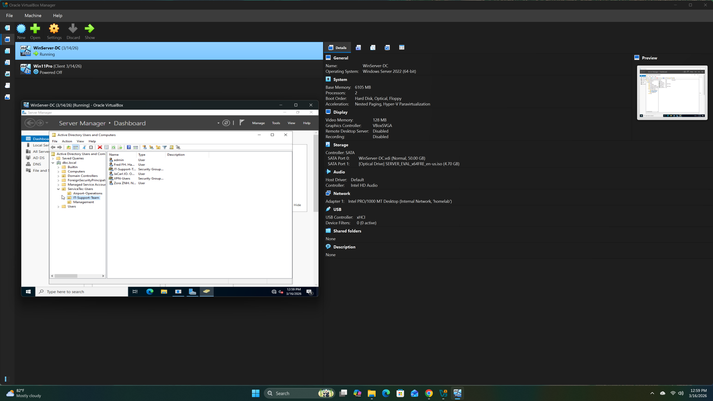
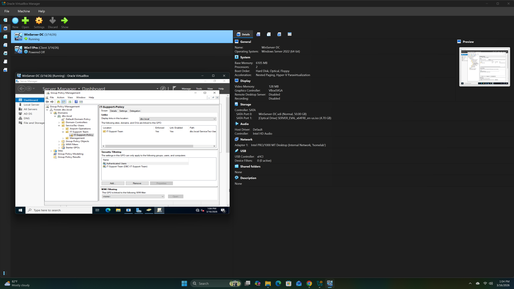

# AD-HomeLab
Active Directory Home Lab Setup
# Active Directory Home Lab

Built a fully functional Active Directory environment in VirtualBox for hands-on learning and cybersecurity skill development.

## Lab Architecture

| Component | OS | Role | IP |
|-----------|-----|------|-----|
| Domain Controller | Windows Server 2022 | AD DS, DNS | 192.168.1.10 |
| Client Workstation | Windows 11 Pro | Domain-joined | 192.168.1.20 |

## What I Built

- [x] Windows Server 2022 Domain Controller
- [x] Active Directory Domain Services (AD DS)
- [x] DNS server configuration
- [x] Windows 11 Pro domain-joined client
- [x] Static IP configuration on internal network
- [x] Domain user authentication

## Key Skills Demonstrated

- VirtualBox VM configuration & networking
- Windows Server administration
- Active Directory deployment
- DNS configuration
- Domain joining & authentication
- TCP/IP networking on isolated internal network

## Tools Used

- VirtualBox
- Windows Server 2022 Evaluation
- Windows 11 Pro
- Active Directory Users and Computers
- Server Manager

## Troubleshooting Log

| Issue | Error Message | Root Cause | Solution |
|-------|---------------|------------|----------|
| VM won't start | "VT-x is disabled in the BIOS" | Hardware virtualization disabled | Enabled VT-x in BIOS/UEFI settings |
| VM aborts | "Not in a hypervisor partition" | Hyper-V conflicting with VirtualBox | Disabled Hyper-V via Windows Features |
| Windows 11 reinstall | Automatically installs Home edition | Previous installation cached | Deleted VHD and recreated VM from scratch |
| Domain join fails | "Specified username is invalid" | Used forward slash instead of backslash | Changed `DBC/Admin` to `DBC\Administrator` |
| Domain option greyed out | Can't select "Domain" radio button | Windows 11 Home doesn't support domain join | Reinstalled Windows 11 Pro |

## Lessons Learned

### Virtualization Setup
- **Always check BIOS first** - VT-x/AMD-V must be enabled before any VM work
- **Hyper-V conflicts** - Windows 11 has Hyper-V features enabled by default that block VirtualBox; disable them
- **Promiscuous mode** - Leave on "Deny" for basic AD labs; only enable for packet sniffing

### Windows Server Configuration
- **Desktop Experience** - Choose GUI version for learning; Core is command-line only
- **DNS setup** - Point DNS to `127.0.0.1` (loopback) on the domain controller itself
- **Forest vs Tree** - First domain controller = new forest, not child domain
- **Delegation warning** - Normal for new forests; no action required

### Windows 11 Client
- **Edition matters** - Home edition cannot join domains; must use Pro/Enterprise/Education
- **Force Pro selection** - Use `Shift+F10` → `regedit` → add `BypassNRO` DWORD during setup
- **Username format** - Always use `DOMAIN\Username` (backslash, not forward slash)
- **Network settings** - Set DNS to domain controller IP before attempting domain join

### Active Directory
- **Built-in accounts** - Administrator and Guest are created automatically; Guest is disabled by default
- **Domain join credentials** - Use `DBC\Administrator` not just `admin` or `administrator`
- **Internal network** - Isolated network prevents conflicts; no internet needed for basic AD

## Next Steps

- [ ] Create organizational units (OUs)
- [ ] Deploy Group Policy objects
- [ ] Set up file sharing & permissions
- [ ] Practice user/group management
- [ ] Explore AD security features
- [ ] Document Group Policy configurations

## Screenshots

*Server Manager showing Active Directory Domain Services installed and running*

*Active Directory Users and Computers console with DBC.local domain*

*Windows 11 System Properties showing successful domain join to DBC.local*

*Static IP configuration on Windows Server 2022 Domain Controller*

*DNS settings on Windows 11 client pointing to domain controller*

---

**Built:** March 2026  
**Purpose:** Cybersecurity skill development & job interview preparation

## Active Directory GPO & Shared Resources Lab

### Domain Architecture
- **Domain:** DBC.local
- **Domain Controller:** Windows Server 2022 (192.168.1.10)
- **Client:** Windows 11 Pro domain-joined (192.168.1.20)
- **Network:** Isolated internal network (VirtualBox)

### User & Group Management
- Created hierarchical OU structure: ServiceTec-Users → IT-Support, Airport-Operations, Management
- Provisioned 5 user accounts with standardized naming convention (jowens, jsmith, admin, mgarcia, tnguyen)
- Implemented security groups for role-based access control (RBAC):
  - IT-Support-Team (Global, Security)
  - Airport-Ops-Team (Global, Security)
  - Printer-Access (Global, Security)
  - VPN-Users (Global, Security)
- Applied group nesting: IT-Support-Team nested inside Printer-Access for efficient permission inheritance

### Group Policy Deployment
- **Password Policy:** Enforced 12-character minimum, complexity requirements, 60-day maximum age via GPO linked to IT-Support OU
- **Drive Mapping:** Automated S: drive mapping to `\\Server-DC\Shared` for IT Support team using Group Policy Preferences
- **Desktop Management:** Configured standardized wallpaper deployment (tested with GPO settings, validated policy application)
- **Printer Deployment:** Prepared network printer GPO configuration for enterprise deployment scenarios

### Shared Resource Configuration
- Created and shared `C:\Shared` folder on domain controller
- Configured NTFS and share permissions using security groups (not individual users)
- Validated domain user access from Windows 11 client (authenticated as jowens, verified S: drive auto-mapped)

### Troubleshooting & Resolution
| Issue | Diagnosis | Solution |
|-------|-----------|----------|
| VM network isolation | Client/server on mismatched VirtualBox network adapters | Standardized both VMs on Internal Network "homelab" |
| DNS resolution failure | Windows 11 DNS reset to automatic | Manually configured DNS to point to DC (192.168.1.10) |
| Time sync failure | Domain authentication requires time within 5 minutes | Manually synced time, gpupdate succeeded |
| Group Policy application delay | Cached credentials on original Administrator account | Logged in as domain user (jowens), verified policy application |

### Real-World Alignment
Practiced skills directly applicable to ServiceTec's "Junior IT Systems Specialist" requirements:
- Active Directory user/computer management and OU design
- Group Policy deployment for Windows 10/11 enterprise environments
- Network share configuration and permission management
- Domain authentication troubleshooting and DNS resolution
- Security group design and role-based access control (RBAC)

### Verification
- [x] Domain user authentication (jowens@DBC.local)
- [x] Group Policy application (password policy, drive mapping)
- [x] Network resource access (S: drive auto-mapped)
- [x] DNS resolution and domain connectivity
- [x] Time synchronization for Kerberos authentication

### Screenshots

*Active Directory Users and Computers showing OU hierarchy and user accounts*

*Group Policy Management console with IT-Support-Policy linked to OU*

*Group Policy Preferences showing S: drive configuration*

*Shared folder NTFS permissions with IT-Support-Team group*

*Windows 11 client login screen showing DBC domain and jowens user*

*File Explorer showing S: drive successfully mapped via Group Policy*
